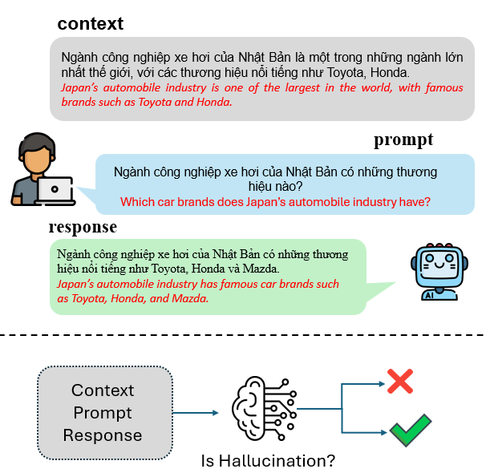
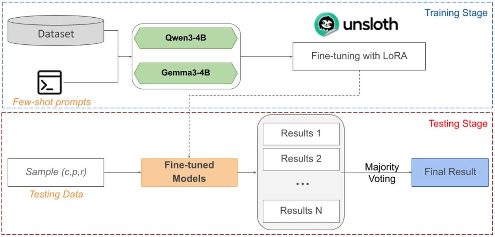
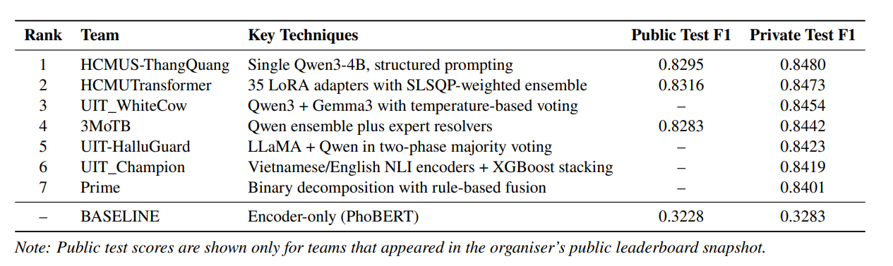

# UIT_WhiteCow at DSC2025: Hallucination Detection for Vietnamese Large Language Models via Fine-tuning and Small Languague Models Ensembles

## Overview

The objective of the challenge is to classify the faithfulness of a Vietnamese LLM’s response given a specific context and prompt.Each sample in the dataset consists of three components:

1. **Context (C):**  A reference passage consisting of 1–3 sentences.

2. **Prompt (P):**  A question or instruction. Prompts are categorized into three types:

  - **Factual:** standard information-seeking questions,  
  - **Noisy:** containing typos or errors,  
  - **Adversarial:** containing distractors or misleading elements.

3. **Response (R):**  The answer generated by the target LLM.

This project detects hallucinations in Vietnamese Large Language Models (LLMs). The system classifies LLM-generated responses into three categories based on their consistency with the provided context and prompt:

- **No Hallucination (no)**: The response is fully consistent with the information in the passage. It does not contain any unsupported information. It correctly answers the prompt based only on the provided context.
- **Intrinsic Hallucination (intrinsic)**: The response contradicts or distorts information specifically mentioned in the passage. The model misinterprets entities, numbers, or relationships present in the source.
- **Extrinsic Hallucination (extrinsic)**: The response contains additional information not found in the passage. Crucially, even if the information is factually true in the real world (e.g., general knowledge), if it cannot be derived from the passage, it is classified as extrinsic.



## System Architecture

Our system consists of two main stages: Training and Testing, as illustrated in the figure below.



### Training Stage

In the training stage, we fine-tune multiple small language models (SLMs), including gemma-3-4b-it and Qwen3-4B-Instruct-2507, using LoRA with the Unsloth framework. The training data is augmented with few-shot prompts to allow the models to better learn the classification patterns of hallucination types.

Each model is independently fine-tuned on the same dataset, resulting in multiple specialized classifiers.

### Testing Stage

During inference, each test sample consisting of ```(context, prompt, response)``` is fed into the fine-tuned models.
Each model produces a predicted label among ```{no, intrinsic, extrinsic}```.

To improve robustness and reduce variance, we apply ensemble learning by aggregating predictions from multiple models and multiple temperature settings using majority voting, producing the final prediction for each sample.

## Project Structure

```
├── train.py              # Training script for all models
├── inference.py          # Inference script with multiple modes
├── utils.py              # Utility functions
├── requirements.txt      # Dependencies
└── data/
    ├── few_shot.json     # Few-shot examples
    ├── train/            # Training data
    ├── test/             # Test data
    └── warmup/           # Warmup data
```

## Installation

### Requirements

- Python 3.10+ (3.11 recommended)
- CUDA-capable GPU
- 50GB+ free disk space

### Setup

> **Note:** `unsloth` (training) and `vllm` (inference) conflict at the CUDA level and cannot be installed in the same environment. Use two separate environments as shown below.

**Environment 1 — Training:**
```bash
git clone https://github.com/nhatle10/UIT_DSC2025.git
cd UIT_DSC2025

conda create -n train_env python=3.11  # 3.10–3.12 also supported
conda activate train_env
pip install -r requirements_train.txt
```

**Environment 2 — Inference:**
```bash
conda create -n infer_env python=3.11  # 3.10–3.12 also supported
conda activate infer_env
pip install -r requirements_infer.txt
```

### Key Dependencies

- **unsloth**: Optimized LLM training with LoRA
- **transformers**: HuggingFace Transformers (v4.55.4)
- **trl**: Trainer library (v0.22.2)
- **vllm**: Fast inference engine
- **peft**: Parameter-Efficient Fine-Tuning
- **bitsandbytes**: 4-bit/8-bit quantization
- **accelerate**: Training acceleration

## Data Format

### Training/Test CSV

Required columns:

| Column | Description |
|--------|-------------|
| `id` | Unique sample identifier |
| `context` | Reference context |
| `prompt` | Question/request |
| `response` | LLM response |
| `label` | Label: no/intrinsic/extrinsic (training only) |

### Few-shot Examples

The `few_shot.json` file contains example samples used as few-shot demonstrations during training and inference.

## Implementation Details

- Models are fine-tuned using **Unsloth** with **LoRA (Low-Rank Adaptation)** for efficient training.
- Few-shot prompting is used during both training and inference.
- Inference leverages **vLLM** for fast batch processing.
- Supports **4-bit and 8-bit quantization** to reduce GPU memory usage.

## Usage

### Training Models

#### gemma-3-4b-it model (Fine-tuning)

```bash
python train.py \
  --mode train \
  --train_csv data/train/vihallu-train.csv \
  --fewshot_path data/few_shot.json \
  --out_dir lora_gemma3 \
  --model_name unsloth/gemma-3-4b-it \
  --chat_template gemma-3 \
  --max_seq_len 8096 \
  --lora_r 32 \
  --lora_alpha 32 \
  --epochs 5 \
  --per_device_train_batch_size 4 \
  --gradient_accumulation_steps 8 \
  --lr 5e-5 \
  --weight_decay 0.01
```

#### Qwen3-4B-Instruct-2507 (Fine-tuning)

```bash
python train.py \
  --mode train \
  --train_csv data/train/vihallu-train.csv \
  --fewshot_path data/few_shot.json \
  --out_dir lora_qwen3 \
  --model_name unsloth/Qwen3-4B-Instruct-2507 \
  --chat_template qwen3-instruct \
  --max_seq_len 8096 \
  --lora_r 32 \
  --lora_alpha 32 \
  --epochs 5 \
  --per_device_train_batch_size 4 \
  --gradient_accumulation_steps 8 \
  --lr 5e-5 \
  --weight_decay 0.01
```

#### Continue Fine-tuning from Checkpoint

```bash
python train.py \
  --mode continue_train \
  --train_csv data/train/vihallu-train.csv \
  --fewshot_path data/few_shot.json \
  --out_dir lora_gemma3 \
  --model_name unsloth/gemma-3-4b-it \
  --chat_template gemma-3
```

### Training Parameters

#### Key Arguments

- `--model_name`: Base model identifier (e.g., `unsloth/gemma-3-4b-it`)
- `--max_seq_len`: Maximum sequence length (default: 8096)
- `--lora_r`: LoRA rank (default: 32)
- `--lora_alpha`: LoRA alpha (default: 32)
- `--epochs`: Number of training epochs
- `--per_device_train_batch_size`: Batch size per device
- `--gradient_accumulation_steps`: Gradient accumulation steps
- `--lr`: Learning rate (default: 5e-5)
- `--weight_decay`: Weight decay for regularization
- `--load_in_8bit`: Use 8-bit quantization (default: 4-bit)

## Model Differences

| Feature | gemma-3-4b-it | Qwen3-4B-Instruct-2507 |
|--------|---------|-------|
| Base model | unsloth/gemma-3-4b-it | unsloth/Qwen3-4B-Instruct-2507 |
| Chat template | gemma-3 | qwen3-instruct |
| User message format | `<start_of_turn>user\n` | `<\|im_start\|>user\n` |
| Model response format | `<start_of_turn>model\n` | `<\|im_start\|>assistant\n` |

Due to these differences, the `--chat_template` argument is used to select the appropriate template when running `train.py`.

### Inference with Pretrained Models

We provide our fine-tuned models publicly on Hugging Face, allowing users to run inference directly without retraining:

- **Qwen3-4B-Instruct-2507 (fine-tuned):** `nhatle10/uit_qwen3_reason`  
- **gemma-3-4b-it model (fine-tuned):** `nhatle10/uit_gemma3-4b-it`

You can generate predictions using multi-temperature sampling and ensemble voting as follows:

```bash
python3 inference.py \
  --mode multi_temp \
  --model_path nhatle10/uit_qwen3_reason \
  --test_csv ./data/test/vihallu-private-test.csv \
  --model_prefix qwen3_preds \
  --raw_output_dir raw_output
```

```bash
python3 inference.py \
  --mode multi_temp \
  --model_path nhatle10/uit_gemma3-4b-it \
  --test_csv ./data/test/vihallu-private-test.csv \
  --model_prefix gemma3_preds \
  --raw_output_dir raw_output
```

After generating raw predictions, post-process and combine them using majority voting:

```bash
python3 inference.py \
  --mode process \
  --raw_output_dir raw_output \
  --process_dir process_output
```

```bash
python3 inference.py \
  --mode voting \
  --voting_input_dir process_output \
  --voting_output final_submit.csv
```

This pipeline enables efficient inference by leveraging multiple fine-tuned models and temperature settings, followed by ensemble voting to produce the final submission file.

## Results

Our system achieved 3rd place in the UIT_DSC 2025 Hallucination Detection challenge with a Private Test F1-score of 0.8454.



## References

- [Unsloth](https://github.com/unslothai/unsloth): Fast language model training
- [HuggingFace Transformers](https://huggingface.co/docs/transformers/)
- [vLLM](https://docs.vllm.ai/): Fast inference engine
- [LoRA: Low-Rank Adaptation of Large Language Models](https://arxiv.org/abs/2106.09685)

## License

This project is licensed under the MIT License. See the [LICENSE](LICENSE) file for details.
